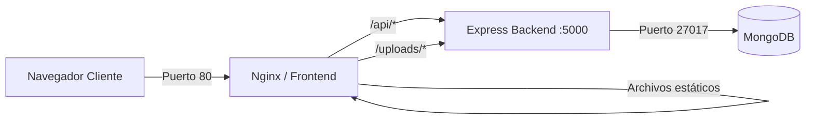

# Kinefy – Seguimiento de Rehabilitación Física

Kinefy es una aplicación web centrada en facilitar el registro de ejercicios y la monitorización del dolor en procesos de rehabilitación. El proyecto surge para cubrir la falta de comunicación estructural entre las sesiones presenciales de fisioterapia, proporcionando un canal de datos real entre el profesional y el paciente.

## Enfoque y Diseño: Organic Minimalism

El proyecto se aleja de los frameworks de componentes tradicionales para priorizar la mantenibilidad y el rendimiento mediante código artesanal:
- **CSS Puro y BEM**: Arquitectura de estilos basada en bloques, sin dependencias externas.
- **Identidad Visual**: Paleta basada en tonos menta y azul con elementos orgánicos para reducir la carga cognitiva del paciente.
- **Accesibilidad**: Cumplimiento de WCAG AA para asegurar la legibilidad y usabilidad.
- **Prototipo Interactivo en Figma**: [Diseño completo de Kinefy en Figma](https://www.figma.com/design/UWZvBTcBHwRixnVFzIuAJy/Proyecto-final-Kinefy?node-id=1-1376&t=qolTzxqMGEtjhyUZ-1) que detalla el diseño de las pantallas y los flujos de usuario.

## Estado del Proyecto (Versión Final - Listo para Entrega)

El proyecto se encuentra totalmente implementado y listo para producción:
- **Orquestación Completa con Docker:** Despliegue en un solo comando mediante Nginx, Node.js y MongoDB en contenedores aislados.
- **Módulo de Fisioterapeuta:** Gestión completa de pacientes, asignación de rutinas, biblioteca persistente de ejercicios y panel de analíticas/adherencia con gráficos evolutivos.
- **Módulo del Paciente (Mobile-First):** Interfaz limpia y adaptativa para visualización de rutinas diarias, reproducción de vídeos descriptivos y registro del nivel de dolor en la escala EVA.
- **Seguridad y Auditoría:** Autenticación robusta basada en JWT y un sistema de restablecimiento/generación segura de contraseñas temporales para pacientes (sin edición directa).
- **Gestión Documental:** Capacidad de adjuntar y almacenar informes médicos e imágenes clínicas dentro de la ficha de cada paciente.

## Arquitectura



## Stack Tecnológico

| Capa | Tecnología | Justificación |
| :--- | :--- | :--- |
| **Frontend** | React (Vite) | SPA para evitar recargas constantes en el uso diario. |
| **Estilos** | CSS Pure / BEM | Control total sobre la jerarquía y rendimiento. |
| **Backend** | Node.js / Express | API REST escalable con separación de responsabilidades. |
| **Base de Datos** | MongoDB | Modelo de datos flexible para pautas de salud variables. |
| **Seguridad** | JWT / Bcrypt | Gestión de sesiones segura y cifrado de contraseñas. |

## Documentación del Proyecto

El detalle técnico y académico se encuentra en la carpeta `docs/`:

1.  [Introducción y Justificación](docs/01-introduccion.md)
2.  [Descripción del MVP](docs/02-descripcion.md)
3.  [Instalación](docs/03-instalacion.md)
4.  [Guía de Estilos](docs/04-guia-estilos.md)
5.  [Arquitectura Técnica](docs/05-diseno.md)
6.  [Paso a paso del Desarrollo](docs/06-desarrollo.md)
7.  [Pruebas de Sistema](docs/07-pruebas.md)
8.  [Despliegue](docs/08-despliegue.md)
9.  [Guía de Uso](docs/09-manual-usuario.md)
10. [Conclusiones finales](docs/10-conclusiones.md)
11. [Evaluación de Despliegue](docs/11-despliegue-eval.md)
12. [Credenciales de Prueba](docs/12-credenciales-prueba.md)
---

## Credenciales de Acceso Rápido (Pruebas)

Para facilitar la evaluación del proyecto por el tribunal, se han pre-configurado dos cuentas de prueba en el entorno local:

*   **Fisioterapeuta (Administrador):**
    *   **Email:** `natalia@kinefy.com`
    *   **Contraseña:** `Kinefy2024!`
*   **Paciente (Demo):**
    *   **Email:** `carlos.mendoza@gmail.com`
    *   **Contraseña:** `Paciente2024!`

> **Nota:** Para mayor detalle sobre el flujo de correos y variables, consulta la documentación en [docs/12-credenciales-prueba.md](docs/12-credenciales-prueba.md).

---

## Inicio Rápido

### Opción A: Docker (Recomendado)
Requisito: Docker Desktop instalado.

```bash
# Clonar y levantar todo el sistema (Base de datos + API + Web)
docker compose up --build
```
La aplicación estará disponible en `http://localhost`.

### Opción B: Desarrollo Local
Requisitos: Node.js (v18+) y MongoDB local.

```bash
# Servidor
cd kinefy-backend && npm install && npm run dev

# Cliente
cd kinefy-frontend && npm install && npm run dev
```


---
Proyecto Final de Ciclo (2º DAW) - **Natalia Alejo Pérez**.
