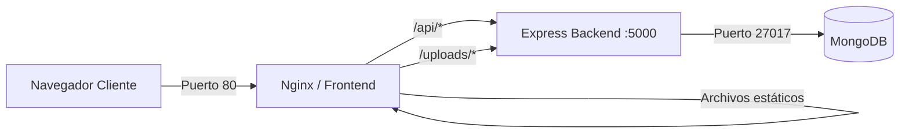

# 5. Diseño Técnico y Arquitectura

El diseño técnico de Kinefy se ha fundamentado en la creación de un sistema escalable, mantenible y con una clara separación de responsabilidades (Separation of Concerns). Para lograrlo, se ha optado por una arquitectura cliente-servidor desacoplada utilizando el stack MERN (MongoDB, Express, React y Node.js), complementado con Nginx como servidor web y proxy inverso en el entorno local.

---

## 5.1. Arquitectura del Sistema (Stack MERN)

La aplicación sigue el modelo de arquitectura en tres capas (Presentación, Lógica de Negocio y Datos), implementada con las siguientes tecnologías:

1.  **Capa de Presentación (Frontend): React + Vite**
    *   Se ha construido una *Single Page Application* (SPA) con React.js.
    *   Como empaquetador (bundler) se ha utilizado Vite, lo que reduce drásticamente los tiempos de compilación en desarrollo y optimiza el *bundle* final para producción gracias a Rollup.
    *   La navegación interna se gestiona de forma fluida (sin recargas de página) mediante `react-router-dom`.

2.  **Capa de Lógica de Negocio (Backend): Node.js + Express**
    *   El servidor se ha desarrollado en el entorno de ejecución asíncrono Node.js.
    *   El framework Express.js actúa como enrutador, gestionando las peticiones HTTP, el middleware de seguridad y la comunicación con la base de datos de forma ligera y eficiente.

3.  **Capa de Datos: MongoDB + Mongoose**
    *   Al tratarse de una aplicación médica donde los planes de ejercicios y las métricas pueden variar enormemente en estructura, se optó por una base de datos NoSQL documental (MongoDB).
    *   La comunicación entre el backend y la base de datos se realiza a través del ODM Mongoose, permitiendo definir esquemas (Schemas) estrictos y validaciones a nivel de aplicación.

---

## 5.2. Modelo de Datos (Esquema Conceptual)

La base de datos se estructura en torno a las siguientes entidades o colecciones principales:

*   **Usuarios (`User`):** Colección central que almacena tanto a los fisioterapeutas como a los pacientes. Contiene campos de autenticación (email, password hasheada) y control de acceso (`role: 'fisio' | 'paciente'`).
*   **Ejercicios (`Exercise`):** El catálogo o biblioteca. Almacena metadatos del ejercicio (nombre, descripción, categoría) y enlaces multimedia.
*   **Citas/Rutinas (`Appointment`):** Actúa como entidad relacional que vincula a un paciente, un fisioterapeuta y una lista de ejercicios pautados en una fecha concreta.
*   **Notificaciones (`Notification`):** Sistema de registro de eventos (ej: "Tienes una nueva cita asignada") vinculados a un usuario, con estado de lectura (`leida: boolean`).

---

## 5.3. Diseño de la API RESTful

El servidor expone una API REST estandarizada bajo el prefijo `/api`. Todas las respuestas y peticiones consumen e hidratan payloads en formato `application/json`.

### 5.3.1. Endpoints Principales
La API se ha modularizado agrupando las rutas según su contexto. A continuación se muestra un extracto representativo de la arquitectura REST:

| MÉTODO | ENDPOINT | DESCRIPCIÓN | REQUIERE TOKEN |
| :--- | :--- | :--- | :---: |
| **POST** | `/api/auth/login` | Autenticación de usuario y generación de JWT | ❌ No |
| **GET** | `/api/patients` | Obtener listado de pacientes del profesional | ✅ Sí (Rol Fisio) |
| **POST** | `/api/patients` | Dar de alta a un nuevo paciente | ✅ Sí (Rol Fisio) |
| **GET** | `/api/patients/:id` | Obtener detalle de un paciente concreto | ✅ Sí (Rol Fisio) |
| **POST** | `/api/patients/:id/exercises` | Asignar tabla de ejercicios a un paciente | ✅ Sí (Rol Fisio) |
| **PUT** | `/api/patients/exercises/:id` | Marcar ejercicio diario como "Completado" | ✅ Sí (Rol Paciente) |
| **POST** | `/api/patients/:id/evolution` | Registrar nivel de dolor diario (Escala EVA) | ✅ Sí (Rol Paciente) |
| **GET** | `/api/exercises` | Obtener biblioteca completa de ejercicios | ✅ Sí (Rol Fisio) |
| **POST** | `/api/exercises` | Crear nuevo ejercicio en la biblioteca | ✅ Sí (Rol Fisio) |
| **PUT** | `/api/exercises/:id` | Modificar un ejercicio existente | ✅ Sí (Rol Fisio) |
| **DELETE** | `/api/exercises/:id` | Eliminar un ejercicio de la biblioteca | ✅ Sí (Rol Fisio) |

### 5.3.2. Estándares HTTP
Se respetan rigurosamente los verbos HTTP semánticos:
*   `GET`: Para recuperar recursos (ej. listado de pacientes).
*   `POST`: Para creación de entidades o autenticación.
*   `PUT` / `PATCH`: Para actualización (ej. marcar notificación como leída o modificar ejercicio).
*   `DELETE`: Para borrado de registros.

Las respuestas utilizan códigos de estado estandarizados: `200 OK`, `201 Created`, `400 Bad Request`, `401 Unauthorized`, `403 Forbidden`, `404 Not Found` y `500 Internal Server Error`.

---

## 5.4. Seguridad y Autenticación

Tratándose de una aplicación que maneja información clínica y de progreso personal, la seguridad se ha implementado desde la fase de diseño (*Security by Design*):

1.  **Cifrado de Credenciales:** Las contraseñas de los usuarios jamás se almacenan en texto plano. Se utiliza la librería `bcrypt.js` para aplicar un *hash* irreversible antes de la inserción en la base de datos.
2.  **Autenticación Stateless (JWT):** 
    *   No se utilizan sesiones basadas en cookies persistentes en el servidor.
    *   Al realizar el login, la API emite un **JSON Web Token (JWT)** firmado criptográficamente.
    *   El frontend adjunta este token en la cabecera `Authorization: Bearer <token>` de cada petición posterior.
3.  **Autorización por Roles (Middlewares):**
    *   La API cuenta con middlewares interceptores (ej. `verifyToken` y `isFisio`). Si un usuario con rol 'paciente' intenta ejecutar una petición `DELETE` hacia un recurso de la biblioteca de ejercicios, el middleware detiene la ejecución devolviendo un código `403 Forbidden` antes de llegar al controlador, protegiendo la integridad de los datos.
