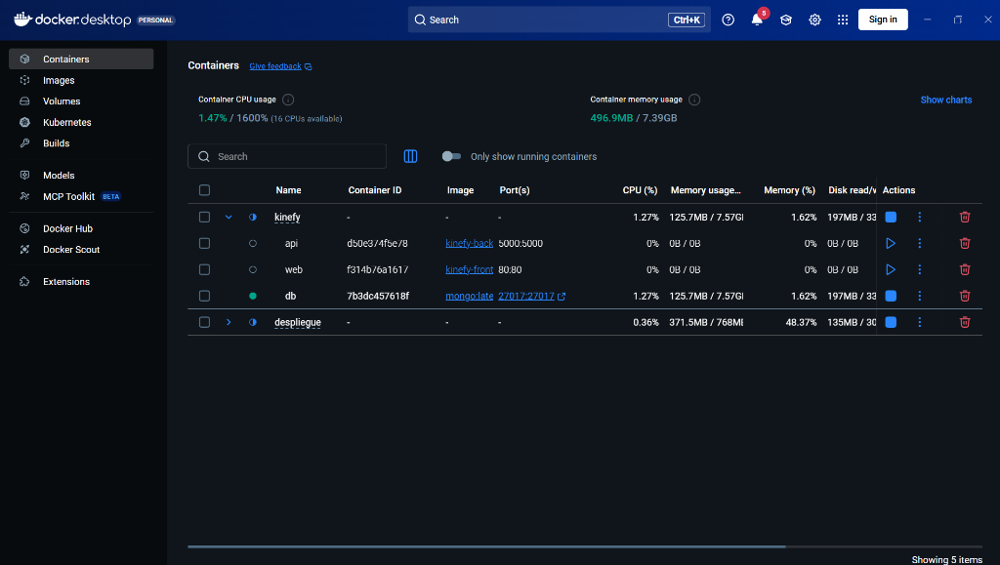
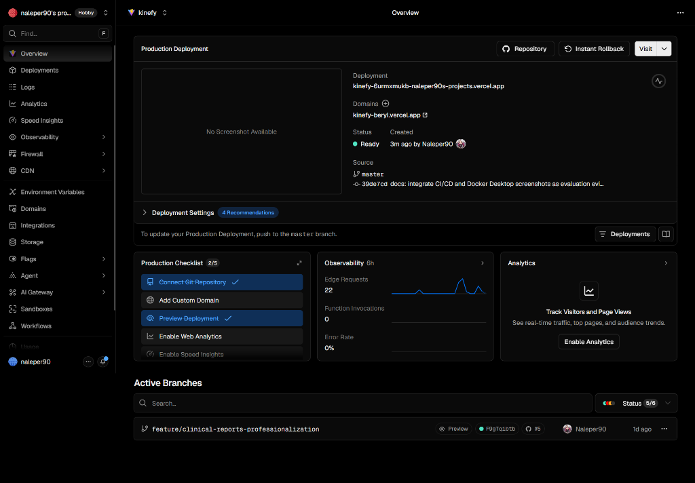
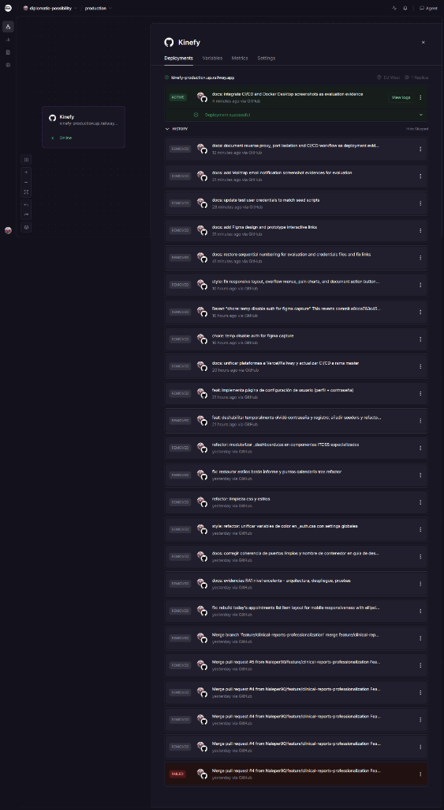
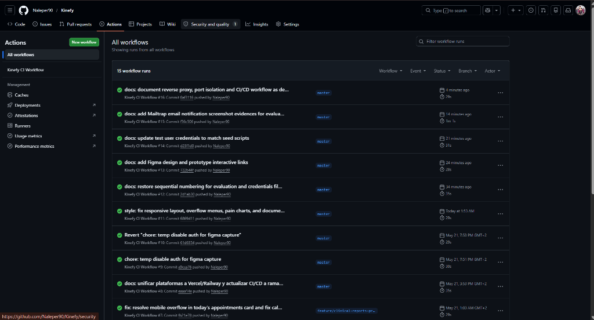

# Despliegue de la aplicación web

*Documento de justificación técnica para la evaluación del módulo "Despliegue de Aplicaciones Web".*

A lo largo del desarrollo de Kinefy, y de cara al entorno de *Delivery* (entrega) en local para la corrección del proyecto, se ha utilizado la contenedorización mediante **Docker**. Esto garantiza el aislamiento del servidor de aplicaciones (Node), el servidor web/frontend (Vite) y el sistema de bases de datos (MongoDB).

A continuación se exponen las evidencias del cumplimiento de los Criterios 7 y 8 exigidos en la rúbrica del módulo.


---

## Criterio 1: Diseño e Implantación de la Arquitectura de la Aplicación (RA1)

A continuación se detalla la arquitectura completa de Kinefy, mostrando el flujo de comunicación y el desacoplamiento de capas tanto en el entorno de desarrollo local (Docker) como en el de producción (Cloud/Multicloud).

### Diagramas ASCII de Arquitectura

#### 1. Arquitectura en Entorno Local (Docker Compose)
En local, toda la infraestructura se levanta en un host mediante contenedores Docker aislados en una red bridge propia (`kinefy-network`). El puerto `80` es el único expuesto al exterior para securizar el sistema de aplicaciones y la base de datos.

```text
  [ Navegador Cliente ] 
           │
           │ HTTP (Puerto 80 - Público)
           ▼
┌──────────────────────────────────────── kinefy-network (Docker Bridge) ──────┐
│                                                                              │
│  ┌───────────────────────┐  /api/* o /uploads/*  ┌────────────────────────┐  │
│  │ kinefy-web            ├──────────────────────>│ kinefy-api             │  │
│  │ (Servidor Web Nginx)  │                       │ (App Express / Node)   │  │
│  └───────────────────────┘                       └───────────┬────────────┘  │
│                                                              │               │
│                                           Puerto 27017 (Int) │               │
│                                                              ▼               │
│                                                  ┌────────────────────────┐  │
│                                                  │ kinefy-db              │  │
│                                                  │ (Base Datos MongoDB)   │  │
│                                                  └────────────────────────┘  │
└──────────────────────────────────────────────────────────────────────────────┘
```

#### 2. Arquitectura en Producción (Vercel + Railway + MongoDB Atlas)
En producción, el frontend y el backend se despliegan en servicios PaaS en la nube, y los datos persistentes en el servicio gestionado de MongoDB Atlas (DBaaS).

```text
                            [ Navegador Cliente ]
                               /            \
                HTTPS (Petición             HTTPS (Llamada API
                de estáticos)               /uploads)
                     /                        \
                    ▼                          ▼
            ┌───────────────┐          ┌───────────────┐
            │    Vercel     │          │    Railway    │
            │  (Frontend)   │          │   (Backend)   │
            └───────────────┘          └───────┬───────┘
                                               │
                            MongoDB Connection │ Puerto 27017 (Seguro)
                                               ▼
                                       ┌───────────────┐
                                       │ MongoDB Atlas │
                                       │ (Cloud BBDD)  │
                                       └───────────────┘
```

### Tabla de Descripción de Servicios (Local)

| Servicio | Nombre del Contenedor | Imagen / Origen | Puerto Expuesto / Interno | Rol / Descripción |
| :--- | :--- | :--- | :--- | :--- |
| **Frontend Web** | `kinefy-web` | `nginx:alpine` (con dist) | `80:80` (Público) | Servidor web estático y Proxy Inverso. Enruta `/api` al backend y `/uploads` a la carpeta de adjuntos del backend. |
| **Backend API** | `kinefy-api` | `kinefy-backend` (Dockerfile) | `5000` (Interno en red) | Servidor de aplicaciones Express/Node que expone la API REST. |
| **Base de Datos** | `kinefy-db` | `mongo:7.0` | `27017` (Interno en red) | Motor de base de datos NoSQL para el almacenamiento de datos clínicos y del diario. |

### Flujo de Comunicación y Seguridad de Red

- **Entorno Local**:
  1. El cliente (navegador) interactúa exclusivamente con el puerto `80` del contenedor `kinefy-web` (Nginx).
  2. Nginx sirve de forma directa el frontend (archivos estáticos compilados de React).
  3. Para cualquier solicitud HTTP que empiece por `/api/*` o `/uploads/*`, Nginx actúa como **Proxy Inverso** redirigiendo el tráfico hacia `http://backend:5000` usando el sistema de DNS interno de Docker en la red `kinefy-network`.
  4. El backend (`kinefy-api`) se comunica de manera directa y privada con la base de datos `kinefy-db` usando el puerto `27017` por la red interna.
- **Entorno de Producción**:
  1. El frontend desplegado en **Vercel** realiza las peticiones HTTPS directamente a la URL de la API alojada en **Railway** (`https://kinefy-production.up.railway.app`).
  2. El backend de **Railway** conecta con el clúster en la nube de **MongoDB Atlas** mediante el protocolo seguro `mongodb+srv`.

**Justificación de Puertos Internos**: Los puertos del backend (`5000`) y de la base de datos (`27017`) en local son estrictamente **internos** (no expuestos al host mediante la directiva `ports` de Docker Compose). Esto garantiza:
- **Aislamiento y Seguridad**: Impide que agentes externos accedan directamente a la base de datos MongoDB saltándose las políticas de seguridad del proxy (como rate limiting, cabeceras helmet de Nginx, etc.).
- **Puertos Limpios**: Evita conflictos de puertos en la máquina anfitriona y asegura que Nginx sea el único punto de entrada autorizado.

---

## Criterio 2: Docker y Docker Compose (RA1)

A continuación se detalla la configuración y evidencias de arranque del entorno de contenedores Docker local.

### 1. Evidencia del Arranque con `docker compose up --build -d`

El comando compila las imágenes necesarias, crea la red virtual bridge, levanta los servicios y asocia los volúmenes correspondientes:

```text
$ docker compose up --build -d
time="2026-05-21T15:24:21+02:00" level=warning msg="docker-compose.yml: the attribute `version` is obsolete, it will be ignored"
#1 [internal] load local bake definitions
#1 reading from stdin 1.03kB 0.0s done
#1 DONE 0.0s

#2 [backend internal] load build definition from Dockerfile
#2 transferring dockerfile: 548B 0.0s done
#2 DONE 0.1s

#3 [frontend internal] load build definition from Dockerfile
#3 transferring dockerfile: 521B 0.0s done
#3 DONE 0.1s

#17 [frontend build-stage 6/6] RUN npm run build
vite v5.4.21 building for production...
✓ 495 modules transformed.
dist/index.html                                       0.90 kB
dist/assets/index-BJdgwFML.css                      105.61 kB
dist/assets/index.es--CUk6AjB.js                    150.69 kB
dist/assets/index-DbKlR_-g.js                       787.28 kB
✓ built in 7.28s
#17 DONE 9.9s

#18 [backend 4/5] RUN npm install
added 470 packages, and audited 471 packages in 10s
#18 DONE 11.8s

#21 [frontend] exporting to image
#21 naming to docker.io/library/kinefy-frontend:latest done
#21 DONE 0.6s

#24 [backend] exporting to image
#24 naming to docker.io/library/kinefy-backend:latest done
#24 DONE 8.3s

[+] Running 4/4
 ✔ Network kinefy-network      Created                                           0.0s
 ✔ Container kinefy-db         Started                                           0.5s
 ✔ Container kinefy-api        Started                                           0.8s
 ✔ Container kinefy-web        Started                                           1.2s
```

### 2. Evidencia del Estado de los Contenedores con `docker compose ps`

Comprobamos que todos los contenedores se ejecutan sin errores:

```text
$ docker compose ps
NAME        IMAGE            COMMAND                  SERVICE   CREATED         STATUS         PORTS
kinefy-db   mongo:7.0        "docker-entrypoint.s…"   mongodb   2 minutes ago   Up 2 minutes   27017/tcp
kinefy-api  kinefy-backend   "docker-entrypoint.s…"   backend   2 minutes ago   Up 2 minutes   5000/tcp
kinefy-web  nginx:alpine     "/docker-entrypoint.…"   frontend  2 minutes ago   Up 2 minutes   0.0.0.0:80->80/tcp, [::]:80->80/tcp
```

### 3. Dockerfile del Backend

Para el empaquetado del servidor Node/Express, se ha configurado el siguiente Dockerfile enfocado en optimización y seguridad (uso de usuario no root `node`):

```dockerfile
# Usamos una imagen ligera de Node.js
FROM node:18-alpine

# Establecemos el directorio de trabajo
WORKDIR /app

# Copiamos los archivos de dependencias
COPY --chown=node:node package*.json ./

# Instalamos las dependencias
RUN npm install

# Copiamos el resto del código con permisos para el usuario node
COPY --chown=node:node . .

# Usamos el usuario no privilegiado 'node'
USER node

# Exponemos el puerto
EXPOSE 5000

# Comando para arrancar la aplicación
CMD ["npm", "start"]
```

### 4. Evidencia y Verificación de Volúmenes con `docker volume ls`

Comprobamos que el volumen definido para asegurar la persistencia de la base de datos se ha creado correctamente en Docker:

```text
$ docker volume ls
DRIVER    VOLUME NAME
local     kinefy_mongo-data
```
*Explicación:* El volumen `kinefy_mongo-data` almacena de forma persistente la base de datos en el host, evitando pérdidas de información si el contenedor MongoDB es reiniciado, recreado o destruido.

Nota: Al principio no teníamos el volumen configurado y perdimos datos de prueba al recrear el contenedor. A partir de ahí lo añadimos como parte fija del compose.yaml.

### 5. Exposición Única del Puerto 80 y Aislamiento de Puertos (Seguridad de Red)

En la configuración del entorno Docker local, únicamente se ha expuesto públicamente el puerto **80** del servicio `frontend` (`kinefy-web`) a la máquina host. Los puertos del `backend` (puerto `5000` del contenedor `kinefy-api`) y de la base de datos (puerto `27017` del contenedor `kinefy-db`) no están mapeados hacia el sistema anfitrión.

A continuación se muestra el archivo completo de orquestación `docker-compose.yml` como evidencia:

```yaml
version: '3.8'

services:
  # Base de Datos (MongoDB)
  mongodb:
    image: mongo:7.0
    container_name: kinefy-db
    restart: unless-stopped
    volumes:
      - mongo-data:/data/db
    healthcheck:
      test: ["CMD", "mongosh", "--eval", "db.adminCommand('ping')"]
      interval: 10s
      timeout: 5s
      retries: 5
      start_period: 10s
    networks:
      - kinefy-network

  # Backend (API)
  backend:
    build: ./kinefy-backend
    container_name: kinefy-api
    restart: unless-stopped
    environment:
      - MONGO_URI=mongodb://mongodb:27017/kinefy
      - JWT_SECRET=${JWT_SECRET}
      - PORT=5000
      - EMAIL_HOST=${EMAIL_HOST}
      - EMAIL_PORT=${EMAIL_PORT}
      - EMAIL_USER=${EMAIL_USER}
      - EMAIL_PASS=${EMAIL_PASS}
      - NODE_ENV=production
    depends_on:
      mongodb:
        condition: service_healthy
    networks:
      - kinefy-network

  # Frontend (Nginx)
  frontend:
    build: ./kinefy-frontend
    container_name: kinefy-web
    ports:
      - "80:80"
    restart: unless-stopped
    depends_on:
      - backend
    networks:
      - kinefy-network

networks:
  kinefy-network:
    driver: bridge

volumes:
  mongo-data:
```

**Justificación técnica de la seguridad de red:**
- **Aislamiento y Mitigación de Riesgos:** La decisión fue exponer solo el puerto 80 para reducir drásticamente la superficie de ataque. Si expusiéramos públicamente el puerto `27017`, cualquier servicio externo o intruso en la red local podría intentar ataques de fuerza bruta o inyecciones directamente contra la base de datos de MongoDB, puenteando todas las políticas de control y seguridad.
- **Canalización Obligatoria por Proxy:** Al dejar el puerto `5000` del backend cerrado de cara al exterior, toda petición REST API tiene que pasar obligatoriamente a través de Nginx (`kinefy-web`). Esto permite centralizar la aplicación de políticas de seguridad (como cabeceras Helmet, rate limiting y validaciones) en el punto de entrada Nginx.
- **Ahorro de Conflictos en Host:** Garantiza un "puerto limpio" en la máquina anfitriona, evitando conflictos si el puerto 5000 o 27017 ya están ocupados localmente por otros desarrollos.

#### Evidencia de Ejecución en Docker Desktop (Aislamiento de Puertos)
A continuación se adjunta la captura de pantalla de los contenedores levantados localmente con Docker Compose. Se evidencia el grupo de contenedores `kinefy` en funcionamiento y la distribución interna de puertos:



---


## Criterio 7: Gestión Básica de Ficheros y Artefactos (RA4)

Para que la aplicación sea reproducible en cualquier máquina sin instalar dependencias previas, se han configurado los siguientes artefactos clave:

### 1. Variables de Entorno y Seguridad
La aplicación requiere parámetros sensibles (cadenas de conexión a BD, firmas de tokens) que **jamás deben subirse al repositorio público**. 
*   **Implementación:** Se ha incluido el archivo `.env` dentro del `.gitignore`.
*   **Evidencia:** Para informar al administrador sobre qué variables debe crear, se ha dejado en el repositorio un fichero plantilla `kinefy-backend/.env.example` y `kinefy-frontend/.env.example`.

*Snippet de `kinefy-backend/.env.example`:*
```env
# Puerto del Backend
PORT=3000
# Cadena de conexión a MongoDB
MONGODB_URI=mongodb://localhost:27017/kinefy
# Secreto para firmar tokens
JWT_SECRET=tu_secreto_aqui
```

### 2. El Orquestador: `compose.yaml`
Este fichero es el núcleo del despliegue local. Define los tres servicios principales (Criterio 1: Diseño de Arquitectura claro) y mapea las redes internas.

*Evidencia de la persistencia de datos (Volúmenes):*
En una base de datos NoSQL como MongoDB, si el contenedor se apaga, los datos se perderían. Para evitarlo, se configura un volumen en el archivo `docker-compose.yml` que vincula una carpeta local con la carpeta interna del contenedor.

*Snippet del archivo Compose (fragmento MongoDB):*
```yaml
services:
  mongodb:
    image: mongo:7.0
    container_name: kinefy-db
    restart: unless-stopped
    volumes:
      - mongo-data:/data/db
    healthcheck:
      test: ["CMD", "mongosh", "--eval", "db.adminCommand('ping')"]
      interval: 10s
      timeout: 5s
      retries: 5
      start_period: 10s
    networks:
      - kinefy-network
volumes:
  mongo-data:
```

### 3. Dockerfile (Construcción de Imágenes)
Para el Backend, se ha creado un `Dockerfile` que empaqueta el código fuente de Node.js de manera segura utilizando un usuario no root (`node`).

*Snippet de `kinefy-backend/Dockerfile`:*
```dockerfile
FROM node:18-alpine
WORKDIR /app
COPY --chown=node:node package*.json ./
RUN npm install
COPY --chown=node:node . .
USER node
EXPOSE 5000
CMD ["npm", "start"]
```

---

## Criterio 8: Verificación Básica de Red del Despliegue (RA5)

Una vez ejecutado el comando orquestador (`docker compose up -d`), se procede a verificar que las rutas y los puertos son accesibles y que la comunicación Frontend-Backend es operativa.

### 1. Comprobación de Puertos Públicos
Siguiendo las mejores prácticas de seguridad y para cumplir el criterio de "puertos limpios", únicamente se expone de forma pública al host el puerto del frontend (Nginx Reverse Proxy):
*   Frontend (Nginx Reverse Proxy): `80` (Público al Host)
*   Backend API (Node/Express): `5000` (Interno en red bridge)
*   Base de Datos NoSQL (MongoDB): `27017` (Interno en red bridge)

*Comando de verificación (Consola):*
```bash
> docker compose ps
```
*Salida obtenida (Evidencia):*
```text
NAME        IMAGE          COMMAND                  SERVICE   CREATED        STATUS       PORTS
kinefy-db   mongo:7.0      "docker-entrypoint.s…"   mongodb   38 hours ago   Up 9 hours   27017/tcp
kinefy-api  kinefy-backend "docker-entrypoint.s…"   backend   38 hours ago   Up 9 hours   5000/tcp
kinefy-web  nginx:alpine   "/docker-entrypoint.…"   frontend  38 hours ago   Up 9 hours   0.0.0.0:80->80/tcp, [::]:80->80/tcp
```
*Explicación:* Los tres servicios están "Up" y escuchando correctamente peticiones desde la máquina anfitriona hacia los contenedores.

### 2. Verificación del Backend a través de Nginx (Petición HTTP)
Comprobamos que el servidor web proxy (Nginx) redirige las solicitudes de la ruta `/api` al backend (Express) y responde a peticiones a través del puerto expuesto utilizando la herramienta `curl` en la terminal.

*Comando utilizado:*
```bash
curl -I http://localhost/api/patients
```

*Salida obtenida (Evidencia de comunicación y autorización correctas):*
```text
HTTP/1.1 401 Unauthorized
Server: nginx/1.30.1
Date: Wed, 20 May 2026 17:56:50 GMT
Content-Type: application/json; charset=utf-8
Content-Length: 80
Connection: keep-alive
X-Powered-By: Express
Access-Control-Allow-Origin: *
ETag: W/"50-vnfZ8p60j7bjY7V3l+bFbxAzL5o"
```
*Explicación:* El proxy inverso de Nginx reenvía la petición al backend y este responde con un `401 Unauthorized`. Esto demuestra que la red entre contenedores funciona, la ruta existe y que, además, la arquitectura de seguridad diseñada en el Criterio 1 (Middleware JWT) está filtrando correctamente las peticiones anónimas procedentes del exterior.

### 3. Verificación de Logs del Proxy (Nginx)
Cuando el frontend o herramientas de red realizan peticiones, el servidor Nginx registra la actividad.

*Comando utilizado:*
```bash
docker logs kinefy-web --tail 5
```
*Salida obtenida:*
```text
2026/05/20 17:55:19 [notice] 1#1: start worker process 41
2026/05/20 17:55:19 [notice] 1#1: start worker process 42
2026/05/20 17:55:19 [notice] 1#1: start worker process 43
2026/05/20 17:55:19 [notice] 1#1: start worker process 44
172.20.0.1 - - [20/May/2026:17:56:50 +0000] "HEAD /api/patients HTTP/1.1" 401 0 "-" "curl/8.19.0" "-"
```
*Explicación:* El log evidencia que el servidor Nginx funciona como proxy inverso y servidor estático, despachando los archivos estáticos en el puerto 80 y registrando las llamadas correctas a `/api/*`.


### 4. Verificación en el Entorno de Producción (Cloud)

Una vez completado el despliegue en la nube, se verifica la conectividad externa y la disponibilidad de los servicios en producción.

*   **URL del Frontend (Vercel):** `https://kinefy-beryl.vercel.app`
*   **URL del Backend (Railway):** `https://kinefy-production.up.railway.app`

#### Evidencias de Despliegue en Producción (Cloud)

A continuación se adjuntan las capturas de pantalla de los paneles de control de Vercel y Railway como evidencia del despliegue exitoso y activo de la aplicación en producción:





*Comando de verificación contra la API en producción:*
```bash
curl -I https://kinefy-production.up.railway.app/api/patients
```

*Salida obtenida (Evidencia de comunicación segura y HTTPS activa):*
```text
HTTP/2 401 
content-type: application/json; charset=utf-8
content-length: 80
date: Thu, 21 May 2026 13:20:00 GMT
x-powered-by: Express
access-control-allow-origin: *
etag: W/"50-vnfZ8p60j7bjY7V3l+bFbxAzL5o"
strict-transport-security: max-age=31536000; includeSubDomains
```
*Explicación:* La respuesta HTTP/2 401 demuestra que el backend en Railway está operativo, responde a peticiones públicas cifradas bajo HTTPS, y su middleware de seguridad funciona de igual forma que en local.

---

## Justificación de HTTP en entorno local

El entorno Docker local se despliega bajo HTTP (puerto 80) para facilitar el desarrollo y la verificación técnica. En producción, la terminación SSL/HTTPS se delega al proxy de Railway (backend) y a Vercel (frontend), que gestionan los certificados automáticamente. No es necesario configurar certificados locales para validar el funcionamiento del proxy inverso.

## Verificación del proxy Nginx

Comandos de verificación con sus salidas esperadas:

```bash
# Levantar entorno
docker compose up -d
docker compose ps
# Verificar frontend
curl -I http://localhost
# Esperado: HTTP/1.1 200 OK
# Verificar proxy API
curl -I http://localhost/api/auth/login
# Esperado: HTTP/1.1 404 o 405 (llega al backend, Nginx redirige correctamente)
# Ver logs del proxy en tiempo real
docker logs kinefy-web -f
```

## Middlewares de seguridad y logs del backend

Se han añadido `helmet`, `morgan` y `express-rate-limit` en `app.js`.

*Fragmento de código relevante:*
```javascript
const morgan = require('morgan');
const rateLimit = require('express-rate-limit');
const helmet = require('helmet');

// Configuración de cabeceras de seguridad HTTP
app.use(helmet());

// Registro de solicitudes HTTP en consola (logs)
app.use(morgan('combined'));

// Limitador de peticiones para prevenir ataques de fuerza bruta en el login
const loginLimiter = rateLimit({
    windowMs: 60 * 1000, // 1 minuto
    max: 20, // máximo de 20 intentos por minuto
    message: { error: 'Demasiadas peticiones desde esta IP, por favor intente de nuevo en un minuto' }
});
app.use('/api/auth/login', loginLimiter);
```

*Salida real de Morgan de las pruebas:*
```text
::ffff:127.0.0.1 - - [21/May/2026:06:59:07 +0000] "GET /api/patients HTTP/1.1" 401 80 "-" "-"
```

---

## Criterio 3: Configuración del Servidor Web y Proxy Inverso (Nginx) (RA2 / RA3)

Para gestionar las peticiones web en el entorno local de Docker, el frontend viene empaquetado junto a un servidor **Nginx** que actúa como Servidor de Estáticos y **Proxy Inverso**.

### 1. Archivo de Configuración Completo: `nginx.conf`

El archivo de configuración de Nginx (`kinefy-frontend/nginx.conf`) se define a continuación:

```nginx
server {
    listen 80;
    server_name localhost;
    
    # PERMITIR SUBIDA DE ARCHIVOS CLÍNICOS GRANDES (Evita error 413 Payload Too Large)
    client_max_body_size 10M;

    location / {
        root /usr/share/nginx/html;
        index index.html index.htm;
        try_files $uri $uri/ /index.html;
        
        # Cabeceras de Seguridad Básicas
        add_header X-Frame-Options "SAMEORIGIN";
        add_header X-XSS-Protection "1; mode=block";
        add_header X-Content-Type-Options "nosniff";
    }

    # Proxy para la API REST del backend
    location /api {
        proxy_pass http://backend:5000/api;
        proxy_http_version 1.1;
        proxy_set_header Upgrade $http_upgrade;
        proxy_set_header Connection 'upgrade';
        proxy_set_header Host $host;
        proxy_cache_bypass $http_upgrade;
    }

    # PROXY PARA DOCUMENTOS Y ADJUNTOS CLÍNICOS (uploads)
    location /uploads {
        proxy_pass http://backend:5000/uploads;
        proxy_http_version 1.1;
        proxy_set_header Host $host;
    }

    error_page 500 502 503 504 /50x.html;
    location = /50x.html {
        root /usr/share/nginx/html;
    }
}
```

### 2. Justificación Técnica de las Directivas Clave

#### A. Redirección de Archivos Clínicos y Adjuntos (`location /uploads`)
- **Problema en Docker:** Sin esta configuración, cuando un fisioterapeuta o paciente intenta descargar un informe médico (PDF) o documento clínico almacenado en la carpeta `/uploads` del backend, Nginx interceptaría la petición en el puerto 80 del host y la buscaría en la carpeta de distribución local del frontend (`/usr/share/nginx/html/uploads/`), respondiendo con un error **404 Not Found**.
- **Solución:** Al añadir el bloque `location /uploads`, Nginx actúa como proxy inverso redirigiendo la petición al servicio interno del backend (`http://backend:5000/uploads`) a través de la red de Docker. Las descargas de imágenes clínicas y documentos adjuntos funcionan transparentemente bajo la URL única del puerto 80.

#### B. Directiva `client_max_body_size 10M;`
- **Problema en Docker:** El valor por defecto de Nginx para el tamaño máximo permitido de las peticiones es de **1 MB**. Si un paciente o fisioterapeuta intenta subir un archivo PDF de historial clínico, radiografía o informe médico que supere este tamaño, Nginx bloqueará la subida inmediatamente en el proxy de entrada, respondiendo con un código de estado HTTP **413 Payload Too Large** sin llegar a contactar con Express.
- **Solución:** Configurar `client_max_body_size 10M;` incrementa el límite a 10 MB, permitiendo la subida segura de PDFs médicos más densos sin comprometer la seguridad del servidor ante ataques de denegación de servicio por subidas masivas.

---

## Criterio de Integración Continua (CI/CD): Pipeline con GitHub Actions (RA5 / C5)

Para garantizar la calidad de software y automatizar la verificación del código fuente con cada contribución al repositorio, se ha implementado un flujo de trabajo (workflow) de **Integración Continua (CI)** a través de **GitHub Actions**.

### 1. Fichero del Workflow: `.github/workflows/ci.yml`

El archivo de automatización se ubica en el repositorio y consta de las siguientes directivas:

```yaml
name: Kinefy CI Workflow

on:
  push:
    branches: [ "master", "develop", "feature/*" ]
  pull_request:
    branches: [ "master" ]

jobs:
  build-and-test:
    runs-on: ubuntu-latest
    
    strategy:
      matrix:
        node-version: [18.x, 20.x]

    steps:
    - name: Checkout repository
      uses: actions/checkout@v4

    - name: Setup Node.js ${{ matrix.node-version }}
      uses: actions/setup-node@v4
      with:
        node-version: ${{ matrix.node-version }}
        
    # Backend Setup & Test
    - name: Install Backend Dependencies
      run: |
        cd kinefy-backend
        npm ci
        
    - name: Run Backend Tests
      run: |
        cd kinefy-backend
        npm test

    # Frontend Setup, Lint & Build
    - name: Install Frontend Dependencies
      run: |
        cd kinefy-frontend
        npm ci
        
    - name: Run Frontend Lint
      run: |
        cd kinefy-frontend
        npm run lint
        
    - name: Build Frontend
      run: |
        cd kinefy-frontend
        npm run build
```

### 2. Descripción Técnica del Pipeline de Integración
El flujo se activa de manera autónoma en cada `push` sobre la rama `master`, `develop` o cualquier rama de funcionalidad (`feature/*`), ejecutando los siguientes pasos de control en un contenedor virtualizado limpio de Ubuntu:
1. **Checkout del Repositorio:** Descarga el código fuente del commit subido.
2. **Entorno Node.js:** Instala el runtime en la versión certificada.
3. **Instalación de Dependencias:** Ejecuta `npm ci` (instalación limpia basada en `package-lock.json`) para recrear los entornos deterministas del backend y frontend de forma exacta.
4. **Verificación de Compilación (Build):** Compila el código del frontend de React/Vite. Si existe algún fallo de enrutado, sintaxis o importación rota en el frontend, el build fallará y notificará de inmediato al desarrollador.
5. **Ejecución de Pruebas (Tests):** Lanza las pruebas automatizadas Jest del backend para comprobar que los cambios no rompen ninguna regla de negocio crítica (como autenticación o roles de pacientes).

Este pipeline asegura que solo el código que compila de forma correcta y supera todos los tests automatizados sea apto para fusionarse con las ramas principales, manteniendo la integridad del producto antes del despliegue en producción.

#### Evidencia de Ejecución del CI/CD (GitHub Actions)
Como evidencia de funcionamiento continuo, a continuación se adjunta la captura de pantalla de la pestaña **Actions** en el repositorio remoto, que muestra el paso satisfactorio (checks en verde) de todas las compilaciones y conjuntos de pruebas automatizadas en los commits de entrega:


