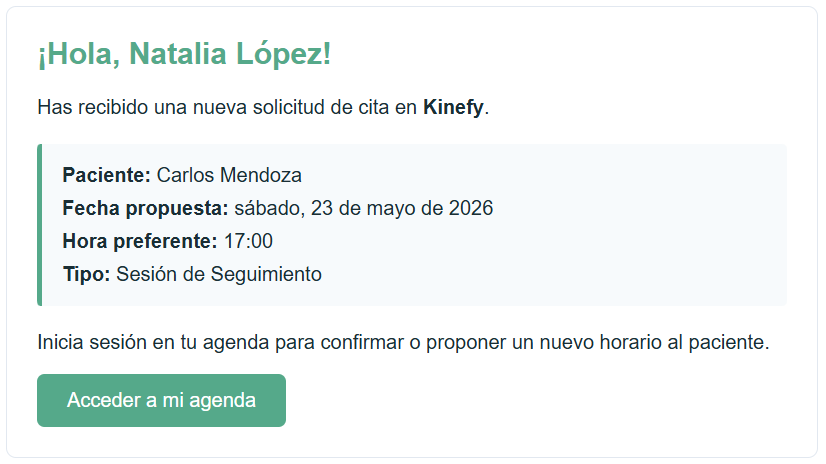
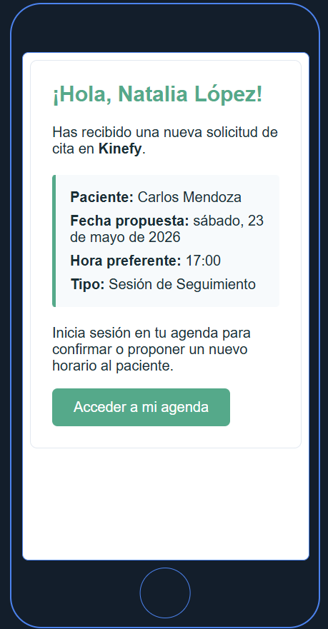
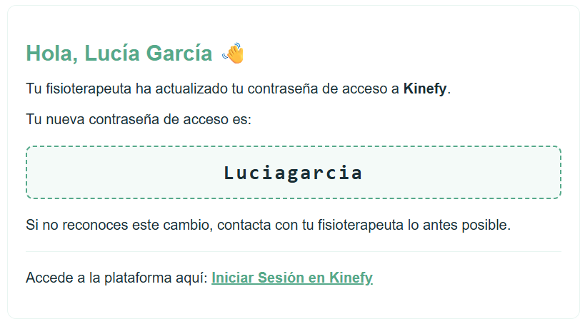
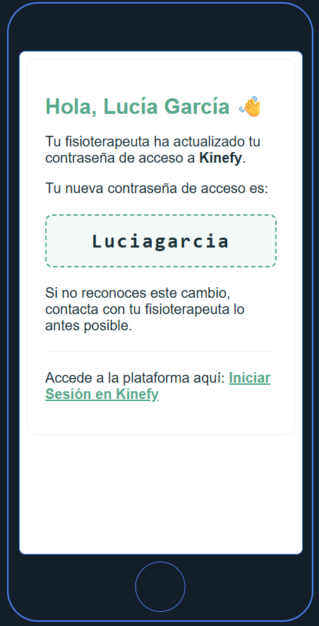

# 10. Credenciales de Prueba

Para facilitar la evaluación del proyecto por parte del tribunal y de los docentes, se incluyen dos cuentas de referencia que pueden utilizarse sin necesidad de crear usuarios nuevos.

## 🔐 Cuenta de **Fisioterapeuta** (admin)
- **Email:** `natalia@kinefy.com`
- **Contraseña:** `Kinefy2024!`
- **Rol:** `fisioterapeuta`
- **Permisos:** Acceso completo a la gestión de pacientes, creación de rutinas, reset de contraseñas y visualización de auditorías.

## 🧑‍⚕️ Cuenta de **Paciente** (demo)
- **Email:** `carlos.mendoza@gmail.com`
- **Contraseña:** `Paciente2024!`
- **Rol:** `paciente`
- **Características:** Paciente pre‑creado asociado al fisioterapeuta anterior, con algunos ejercicios asignados y datos de evolución cargados para poder demostrar la visualización de gráficas y la captura de la escala EVA.

> **Nota:** Ambas cuentas están creadas en la base de datos de desarrollo (MongoDB local). Si los contenedores se vuelven a crear (`docker compose down && docker compose up -d`), los datos persisten gracias al volumen configurado para MongoDB.

## 📧 Pruebas de envío de correo
- El backend está configurado para usar **Mailtrap** (ver `.env`).
- Cuando se crea o se restablece la contraseña del paciente, el correo se envía a la caja de Mailtrap configurada.
- Para observar el mensaje, abre tu bandeja de Mailtrap y busca el correo con asunto **"Bienvenido/a a Kinefy"** o **"Restablecer contraseña"**.
- No es necesario disponer de un correo real; Mailtrap captura los envíos sin enviarlos a usuarios externos.

### 📸 Evidencias de Envío de Correos (Capturas de Mailtrap)

Dado que las pruebas locales de envío se capturan de forma aislada en Mailtrap para no requerir servidores SMTP reales ni direcciones físicas activas en producción, a continuación se adjuntan las evidencias de maquetación y recepción de los correos automáticos del sistema:

#### 1. Correo de Nueva Solicitud de Cita (Recibido por Fisioterapeuta)
*   **Destinatario:** `natalia@kinefy.com` (Fisioterapeuta)
*   **Descripción:** Informa a la profesional de que un paciente ha sugerido una fecha y hora preferentes para su sesión.

| Vista Escritorio | Vista Móvil |
| :---: | :---: |
|  |  |

#### 2. Correo de Restablecimiento/Generación de Contraseña (Recibido por Paciente)
*   **Destinatario:** `lucia.sanchez@outlook.com` (Paciente)
*   **Descripción:** Contiene la clave temporal autogenerada por el sistema que permite el inicio de sesión seguro o tras un reseteo de credenciales por parte del fisioterapeuta.

| Vista Escritorio | Vista Móvil |
| :---: | :---: |
|  |  |

